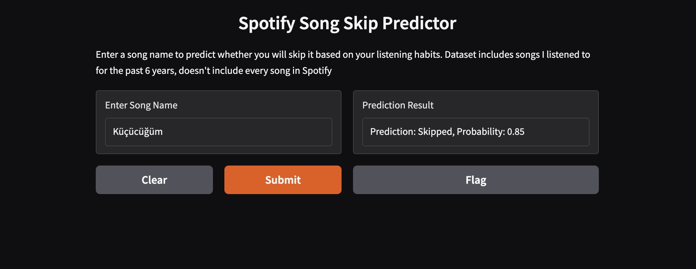

# Spotify Data Analysis: Exploring My Listening Habits

## Motivation

In the grim darkness of the far future, there is only data. I embarked on this holy crusade of analysis to uncover the sacred patterns within my Spotify listening habits. What artists dominate my auditory battlefields? What songs carry me through the trenches of daily life? And, most importantly, can a machine be taught to predict whether a song will be skipped—like an unworthy student—based on its traits? 

By undertaking this glorious quest, I wield the weapons of data science and machine learning to forge a deeper understanding of my music consumption. Is this a mere mortal's attempt to understand the Omnissiah's playlist? Nay, it is the union of flesh, steel, and streaming technology to expand my technical skillset and have a good all time along the way.

---

## Data Source

This project’s data was extracted from the vaults of Spotify using the sanctified export feature, combined with my curated playlists of righteous auditory glory. The dataset includes:

- **Song listening history**: Chronicles of every track that has blessed my ears.
- **Playlists**: Detailed tomes of songs from my not so sacred playlists.
- **Timeframe**: Spanning the years of 2019 to 2024, this is my holy scripture of sound. Time that I lost my golden prime...

**Note**: The raw data has been locked away in the Forbidden Archive to protect my identity from data-daemons.(.gitignore)

---

## Data Analysis

Behold the stages of this glorious undertaking:

### 1. Data Cleaning
- Cleansing the dataset of impurities, purging null values, and standardizing column names for consistency. Truly, a Mechanicum-worthy endeavor.

### 2. Exploratory Data Analysis (EDA)
- Deploying powerful Python libraries—Pandas, Matplotlib, and Seaborn—like servo-skulls to visualize and analyze my sacred data.
- Unearthing holy truths such as:
  - The songs and artists I have pledged my allegiance to, sorted by listening hours and play counts.
  - Battle patterns in music consumption across the days, hours, and months.
  - The ratio of unique to non-unique songs in my playlists, to determine if I’m a heretic who repeats songs too much.

### 3. Visualization
- **Bar charts**: A pictorial tribute to my top artists and songs.
- **Pie charts**: Slices of data showing unique vs. non-unique tracks in my musical dominion.
- **Word clouds**: Textual nebulae of my favorite artists and songs.
- **Time-based trends**: Hourly, daily, and monthly streaming patterns laid bare for magistrate.

### 4. Predictive Modeling
- **Goal**: To craft a machine learning model in Jupyter Notebook, a shrine of computation, to predict why a track was opened (`reason_start`). Is it divine intervention, or mortal folly?
- **Approach**:
  - Deploying Random Forest (or better models if the Machine Spirit demands it).
  - Utilizing scikit-learn as the sacred cogitator for training and evaluation.
- **Evaluation**:
  - Judging the machine’s worthiness with metrics like accuracy, precision, recall, and confusion matrices—tools of the data inquisition.
- **Features**:
  - Song-level: Traits of the track, such as duration and artist.
  - User-level: Behavioral patterns like skipping frequency.
  - Context-level: The time of day and the device used—factors that influence the mind of the listener.

---

## Findings

From the ashes of raw data rise these truths:

- **Top Artists and Songs**:
  - My most revered artists and tracks, crowned by listening time and play counts.
  - The genres and moods that align with my soul on the lost war, which is life.
- **Streaming Patterns**:
  - Days and hours when I am most active, showing the tactical deployment of sound.
  - Seasons of heightened streaming—perhaps when inspiration or despair takes hold.
- **Repetition**:
  - How often I repeat songs like an Ecclesiarch chanting hymns (spoiler: a lot(pls don't judge me)).
- **Prediction**:
  - Insights from the predictive model about what drives my listening behavior—akin to discovering the motives of a procastinating scholar.

---

## Limitations and Future Work

### Limitations (Expected):
1. **Data Diversity**:
   - This dataset reflects only my listening habits. Generalizing it to others would be heresy(just kidding). Could implement a broader dataset. My computers processor was not taking it, also, it is hard.
2. **Class Imbalance**:
   - Some `reason_start` categories may dominate like a Hive Tyrant, skewing predictions for less common reasons.
3. **Feature Limitations**:
   - External factors like mood or social context are not included. Alas, not even the Machine Spirit can read my mind (yet).

### Future Work:
1. **Advanced Modeling**:
   - Experiment with deep learning models or ensemble techniques, provided the GPU approves.
2. **Broader Analysis**:
   - Compare my personal habits to the collective trends of the Imperium of Spotify users.
3. **Additional Predictions**:
   - Extend the machine’s reach to predict skip likelihood, playlist preferences, or favorite genres—useful for commanding playlists of maximum efficiency.

---

## How to Run

To embark on this glorious analysis:

1. Clone this repository from the datasphere to your local cogitator.
2. Open the Jupyter Notebook file (`Spotify_Data_Analysis.ipynb`) in your sacred Jupyter environment.
3. Ensure you have Python and the following machine-empowering libraries installed:
   - Pandas
   - Matplotlib
   - Seaborn
   - Scikit-learn
   - Gradio
4. Execute the cells one by one to:
   - Analyze and visualize the data.
   - Train the predictive model.
5. Activate the Gradio interface to summon predictions from the Machine Spirit via a web-based shrine.

---

## Gradio Interface

The Machine Spirit has blessed this project with a Gradio interface for real-time predictions. Here, users may input a song name to determine whether it is likely to be skipped. Behold the interface below:

---

## Acknowledgments

- **Spotify**: For granting access to the holy relics of my listening data.
- **Python Libraries**: For their role as servo-skulls in aiding analysis and modeling.
- **The Machine Spirit**: For enabling this divine union of music and technology.
